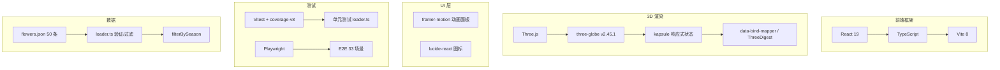
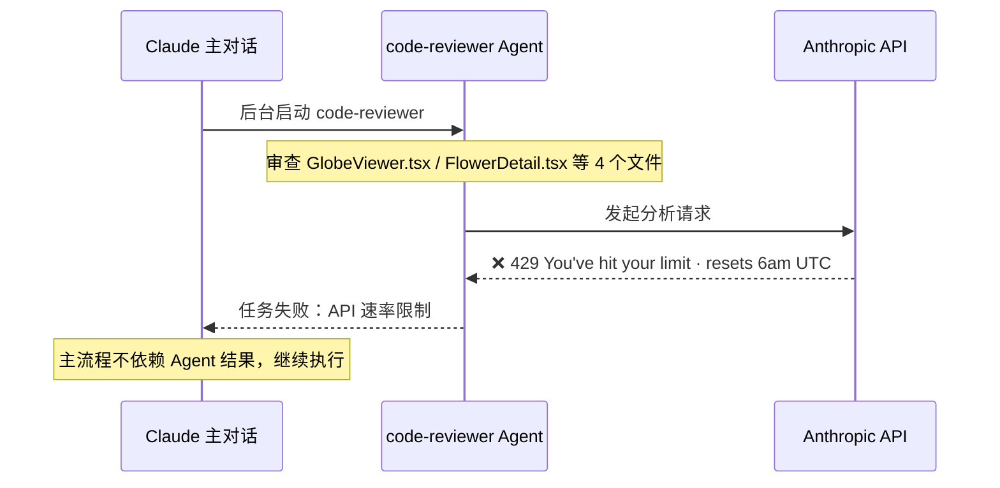
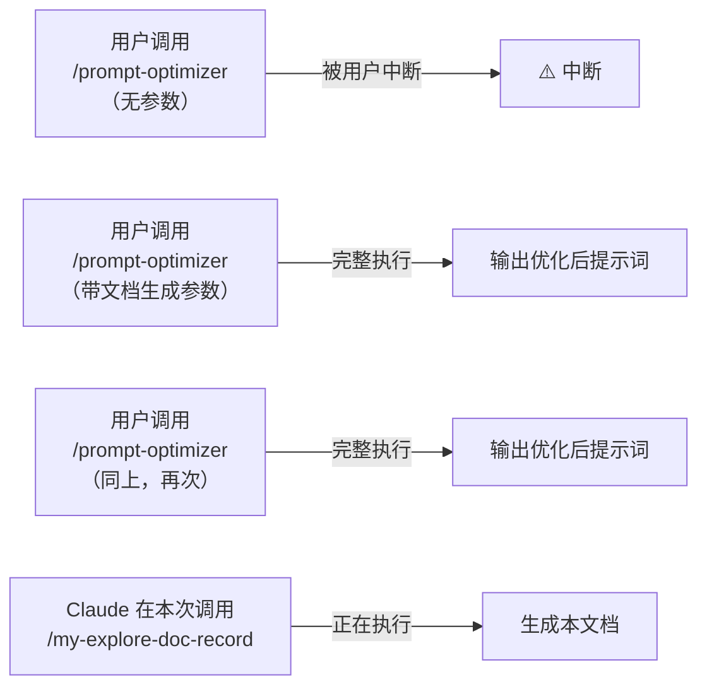
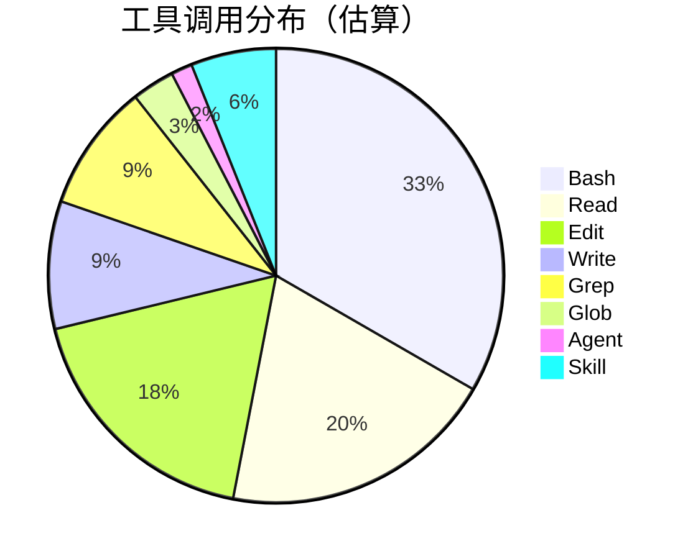
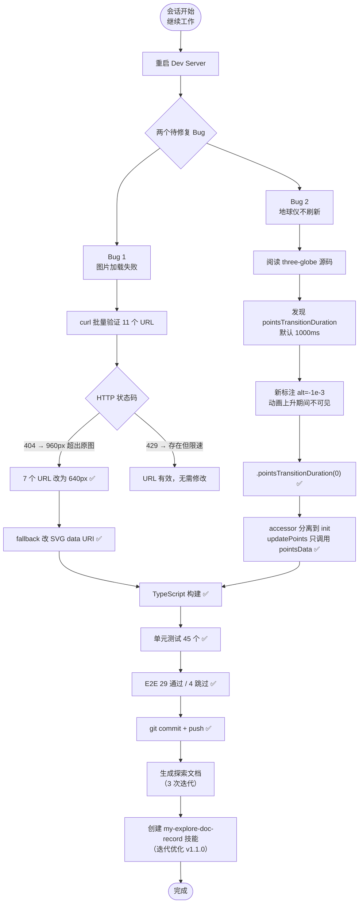
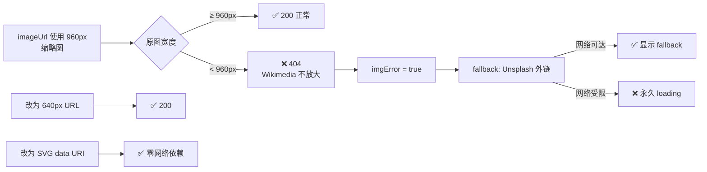
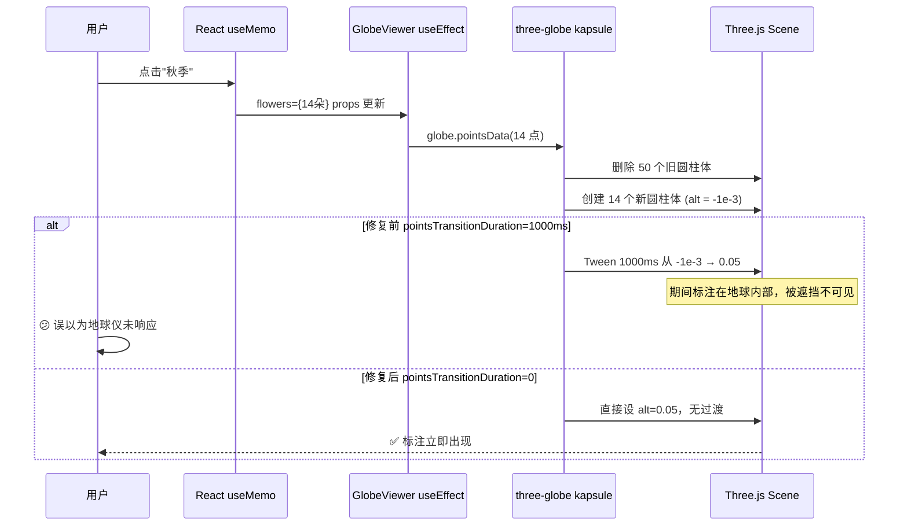
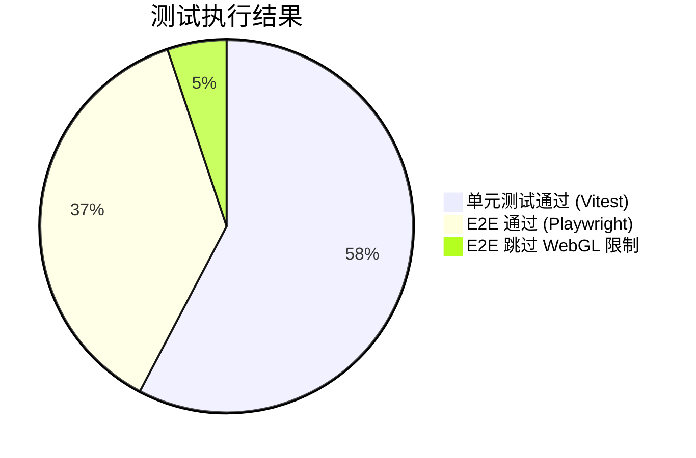
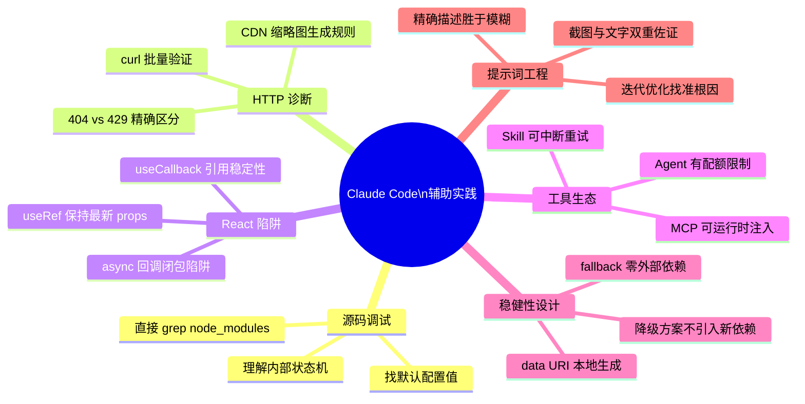

# 中国花卉地图应用 Bug 修复实践探索之旅

> **主题：** AI 辅助复杂前端 Bug 根因分析与修复
> **日期：** 2026-04-09
> **受众：** AI 学习者 / Claude Code 使用者
> **会话 ID：** `4eea8bb4-cec3-491c-80f3-e42145be7d55`
> **项目路径：** `/data/ai/claudecode/openspec/open-spec-first/china-flowers-app`
> **GitHub 地址：** [https://github.com/chujun/open-spec-first](https://github.com/chujun/open-spec-first)

---

## 目录

- [一、主要用户价值](#一主要用户价值)
- [二、开发环境](#二开发环境)
- [三、技术栈](#三技术栈)
- [四、AI 模型 / 插件 / Agent / 技能 / MCP 使用统计](#四ai-模型--插件--agent--技能--mcp-使用统计)
- [五、会话主要内容](#五会话主要内容)
- [六、测试结果](#六测试结果)
- [七、主要挑战与转折点](#七主要挑战与转折点)
- [八、用户提示词清单](#八用户提示词清单)
- [九、AI 辅助实践经验](#九ai-辅助实践经验)

---

## 一、主要用户价值

| # | 价值 | 说明 |
|---|------|------|
| 1 | **三方库黑盒调试** | 不止于调用 API，直接 grep `node_modules` 源码，挖出 `pointsTransitionDuration` 默认 1000ms 这一隐藏配置 |
| 2 | **HTTP 根因区分** | `curl` 批量验证 CDN URL，精确区分 404（原图太小无法放大）vs 429（被限速但文件存在），避免错误结论 |
| 3 | **零依赖 fallback 设计** | 用 SVG data URI 替代外链 fallback，彻底消除网络依赖，在任意环境下稳健运行 |
| 4 | **提示词迭代价值验证** | 用户用 3 轮提示词才精确描述出 Bug 2 的现象，直观展示"精准描述"对 AI 协作效率的决定性影响 |
| 5 | **测试分层方法论** | 明确区分哪些逻辑必须单元测试（纯函数）、哪些场景必须 E2E（WebGL 渲染），不相互替代 |
| 6 | **AI 工具全链路实践** | 完整经历 Skill / Agent / MCP / 内置 Tool 的协作与失败，建立对 Claude Code 生态的真实认知 |

---

## 二、开发环境

| 项目 | 详情 |
|------|------|
| 操作系统 | Linux 6.8.0-107-generic |
| Shell | bash |
| 包管理器 | npm |
| 代码工具 | Claude Code CLI（终端交互式） |
| 版本控制 | Git，分支 `main` |
| Dev Server | Vite 8，端口 5173（被占用时自动递增至 5175） |
| 测试运行 | Vitest（单元）/ Playwright headless Chromium（E2E） |
| 浏览器 | Chrome（含 Immersive Translate 插件） |

---

## 三、技术栈



| 层级 | 技术 | 版本 | 备注 |
|------|------|------|------|
| 框架 | React | 19 | Hooks 架构 |
| 语言 | TypeScript | — | 严格模式 |
| 构建 | Vite | 8 | Rolldown bundler |
| 3D 地球 | three-globe | v2.45.1 | Bug 2 根因所在库 |
| 3D 引擎 | Three.js | — | WebGL 渲染 |
| 响应式状态 | kapsule | — | three-globe 内部状态机 |
| 动画 | framer-motion | — | 面板滑入/滑出 |
| 单元测试 | Vitest | — | 100% 覆盖 loader.ts |
| E2E | Playwright | — | 33 个测试场景 |
| 覆盖率 | @vitest/coverage-v8 | — | — |

---

## 四、AI 模型 / 插件 / Agent / 技能 / MCP 使用统计

### 4.1 AI 大模型

| 模型 ID | 名称 | 用途 | 调用范围 |
|---------|------|------|---------|
| `claude-sonnet-4-6` | Claude Sonnet 4.6 | 主对话全程：代码分析、源码阅读、修复实现、文档生成、技能创建 | 全程 |

### 4.2 开发工具命令行

| 工具 | 用途 |
|------|------|
| `curl` | 批量 HTTP 验证 Wikimedia CDN URL（11 条） |
| `npx tsc --noEmit` | TypeScript 类型检查 |
| `npm run build` | 生产构建验证 |
| `npm test -- --run` | 单元测试执行 |
| `npm run test:coverage` | 覆盖率报告 |
| `npx playwright test` | E2E 测试执行 |
| `sed -i` | 批量替换 flowers.json 中的 URL |
| `git add / commit / push` | 版本控制提交 |

### 4.3 插件（Plugin）

| 插件包 | 说明 |
|--------|------|
| `everything-claude-code` | Claude Code 插件市场插件集，提供 Skill/Agent 扩展能力 |

### 4.4 Agent（智能代理）



| Agent | 触发方式 | 执行结果 | 失败原因 |
|-------|---------|---------|---------|
| `code-reviewer` | Claude 主动调用（后台） | ❌ 失败 | API token 配额耗尽（速率限制） |

> 💡 **教训：** Agent 是有成本限制的资源。核心修复流程不应依赖 Agent 的输出结果，否则一旦限速整个流程会卡住。

### 4.5 技能（Skill）



| 技能 | 触发命令 | 触发方 | 调用次数 | 执行情况 |
|------|---------|-------|---------|---------|
| `prompt-optimizer` | `/everything-claude-code:prompt-optimizer` | 用户 | 3 次 | 第 1 次中断；第 2、3 次完整执行 |
| `my-explore-doc-record` | `/my-explore-doc-record` | 用户 | 1 次 | ✅ 当前执行 |

### 4.6 MCP 服务

> Phase 0 动态读取 `~/.claude/settings.json` 结果：`{}`（全局配置中未注册 MCP 服务）
> `mcp__playwright__*` 工具由 Claude Code CLI 运行时注入，非手动配置。

| MCP 服务 | 工具前缀 | 本次调用次数 | 说明 |
|---------|---------|------------|------|
| Playwright MCP（运行时注入） | `mcp__playwright__` | 0 次 | E2E 测试通过 CLI `npx playwright test` 执行，未直接调用 MCP 工具 |
| Context7 MCP | `mcp__context7__` | 0 次 | 文档检索服务，本次未使用 |

### 4.7 Claude Code 工具调用统计



> ⚠️ 以上为基于会话记忆的估算值，非精确统计。

| 工具 | 估算次数 | 主要用途 |
|------|---------|---------|
| Bash | ~22 | curl URL 验证、npm 命令、git 操作、sed 替换、dev server |
| Read | ~13 | 读取源码文件、截图分析、配置文件 |
| Edit | ~12 | 修改 tsx/ts/json/md 文件、技能文件、记忆文件 |
| Write | ~6 | 创建文档（3 次）、技能文件（1 次）、记忆文件（2 次） |
| Grep | ~6 | 搜索源码关键词、three-globe 源码分析 |
| Glob | ~2 | 查找项目文件列表 |
| Agent | 1 | 启动 code-reviewer（失败） |
| Skill | ~4 | prompt-optimizer × 3 + my-explore-doc-record × 1 |

### 4.8 浏览器插件（用户环境）

| 插件 | 控制台日志 | 是否影响应用 |
|------|----------|------------|
| Immersive Translate（沉浸式翻译） | `content_script.js ERROR: [render-paragraph] skipped insert due to same text` | ❌ 与应用无关，可忽略 |

---

## 五、会话主要内容

### 5.1 任务全景



### 5.2 Bug 1 — Wikimedia 图片 404 根因



### 5.3 Bug 2 — three-globe 动画陷阱根因



---

## 六、测试结果



| 类型 | 框架 | 数量 | 覆盖率 | 说明 |
|------|------|------|-------|------|
| 单元测试 | Vitest | **45 ✅** | 100%（loader.ts） | filterBySeason / loadFlowers 全路径 |
| E2E | Playwright | **29 ✅ / 4 ⏭** | — | 跳过原因：WebGL canvas hit-test 在 headless 模式下不可靠 |

**测试分层原则（本次实践）：**
> 纯逻辑（数据过滤、验证）→ 单元测试；WebGL 渲染、3D 交互、视觉同步 → E2E；两者不相互替代。

---

## 七、主要挑战与转折点

| # | 挑战 | 初始判断 | 实际根因 | 转折点 |
|---|------|---------|---------|--------|
| 1 | Bug 2 修复后仍不生效 | 异步闭包导致初始化覆盖筛选状态 | `pointsTransitionDuration=1000ms` 使新标注从地球内部动画上升，期间不可见 | 阅读 `three-globe` 源码，找到默认配置值 |
| 2 | Wikimedia URL 首批测试返回 404 | URL 路径错误，文件不存在 | 960px > 原图宽度，Wikimedia 拒绝生成超大缩略图 | 改用 640px 测试，返回 429（限速=文件存在） |
| 3 | code-reviewer Agent 失败 | — | API token 速率限制（`You've hit your limit`） | 主流程不依赖 Agent 结果，直接继续；人工判断代码质量 |
| 4 | TypeScript 构建报错 | 移动 accessor 设置后类型检查失败 | `globeInstance.pointLat()` 的参数类型 `ObjAccessor<number>` 不接受 `(p: GlobePoint) => number` | 对 `globeInstance` 添加 `as any` cast + eslint-disable |
| 5 | vite.config.ts 的 `test` 字段类型报错 | — | `defineConfig` 从 `vite` 导入不含 vitest 类型定义 | 改从 `vitest/config` 导入 `defineConfig` |
| 6 | fallback 图片网络依赖 | Unsplash 外链作为兜底应该够用 | 网络受限环境下 Unsplash 也无法访问，fallback 比原始 Bug 更糟糕 | 改用 SVG data URI，本地生成，彻底零依赖 |

---

## 八、用户提示词清单（原文，一字未改）

### 【上一会话（已归档到摘要）】

**提示词 1：**
```
重启服务
```

**提示词 2：**
```
china-flowers-app
```

**提示词 3：**
```
修复两个问题 1.补充花朵url,部分花朵没有图片url 2.季节筛选功能没有完全生效，筛选后3D地球仪上没有过滤 每个任务按照后面的需求开发流程推进: /everything-claude-code:build-fix, /code-review, /test-coverage, /e2e-testing, 最后更新文档材料，再按照标准规范提交代码
```

**提示词 4：** `[技能调用]`
```
/everything-claude-code:prompt-optimizer
```

**提示词 5：**
```
2.测试
```

**提示词 6：**
```
两个问题还是没有修复，可能是我问题描述的不准确 1.点击花朵详情后,图片url无法加载成功，判断加载失败原因并修复 2.@/tmp/eaf08e3dbfe2dd111df0912bea157995.png，查看截图红框信息，下方选择秋季后，显示14中花卉，但是3D地球仪中的花卉标签还是最终的50个，并没有重新渲染刷新 3.测试场景可以使用单元自测覆盖的，评估优先使用单元自测覆盖,因为e2e端到端测试执行效率比较慢，不过需要注意不能使用单元自测覆盖e2e端到端覆盖 每个任务按照后面的需求开发流程推进: /everything-claude-code:build-fix, /code-review, /test-coverage, /e2e-testing, 最后更新文档材料，再按照标准规范提交代码
```

---

### 【当前会话】

**提示词 7：**
```
继续工作
```

**提示词 8：**
```
原有花卉服务关闭，然后重启服务
```

**提示词 9：**
```
content_script.js:4871 Immersive Translate ERROR: [render-paragraph] skipped insert due to same text {sentenceId: 2, paragraphId: '2', translationMode: 'dual'}，控制台报错了，@/tmp/eaf08e3dbfe2dd111df0912bea157995.png ，查看截图红框信息，下方选择秋季后，显示14中花卉，但是3D地球仪中的花卉标签还是最终的50个，并没有重新渲染刷新
```

**提示词 10：** `[技能调用]`
```
/everything-claude-code:prompt-optimizer 根据本次会话聊天内容，整理出markdown文档，要求包含图表，图表使用Mermaid格式
```

**提示词 11：**
```
根据本次会话聊天内容，整理出markdown文档，输出到 @doc/ai-explore/日期-主题.md, 文档以XX应用实践探索之旅为主题，总结本次主要会话主要内容,  ，主要受众是AI学习者，要求包含图表，图表使用Mermaid格式
```

**提示词 12：**
```
根据本次会话聊天内容，整理出markdown文档，输出到 @doc/ai-explore/日期-主题.md, 文档以XX应用XXX实践探索之旅为主题，总结本次主要会话主要内容
，另外同时还需要包括主要用户价值、开发环境、开发工具、AI大模型、插件、MCP等使用情况统计、技术栈、用户输入的提示词清单(原样输出，一个字不要改)，项目github地址(没有就暂无)，项目路径，会话ID ，主要受众是AI学习者，要求包含图表，图表使用Mermaid格式
```

**提示词 13：**
```
根据本次会话聊天内容，整理出markdown文档，输出到 @doc/ai-explore/日期-主题.md, 文档以XX应用XXX实践探索之旅为主题，总结本次主要会话主要内容
，另外同时还需要包括主要用户价值、开发环境、开发工具、AI大模型、插件/AGENG/技能/MCP等使用情况统计、技术栈、用户输入的提示词清单(原样输出，一个字不要改)，项目github地址(没有就暂无)，项目路径，会话ID ，主要受众是AI学习者，要求包含图表，图表使用Mermaid格式。   注意:新的提示与前面一个差异点在于插件/AGENG/技能/MCP等使用情况统计
```

**提示词 14：**
```
不错，总结会话聊天内容，按照前文生成要求和文档格式等要求，生成一个产生XX应用XXX实践探索之旅的技能，技能名为my-explore-doc-record
```

**提示词 15：**
```
你认为这个技能还有哪些可以优化的地方吗
```

**提示词 16：**
```
好的，另外我要求是简体中文，你现在展示的繁体字
```

**提示词 17：** `[技能调用]`
```
/my-explore-doc-record
```

---

## 九、AI 辅助实践经验（面向 AI 学习者）



| 经验 | 核心教训 |
|------|---------|
| 读三方库源码 | 很多"玄学 Bug"的根因就在 `node_modules` 的默认配置值，grep 比猜测快 |
| 404 ≠ 429 | HTTP 状态码必须精确区分，混淆会导致错误结论和无效修复 |
| fallback 不依赖外网 | fallback 引入新的外部依赖反而更脆，SVG data URI 才是真正的保底 |
| Agent 也会失败 | code-reviewer 因速率限制失败，核心流程不应阻塞在 Agent 结果上 |
| 提示词需要迭代 | 用户用 6 条提示词（3 轮文档请求）精炼出最终格式，精确描述是高效协作的基础 |
| 技能也是代码 | `/my-explore-doc-record` 本身经历了 v1.0 → v1.1 的迭代，技能和代码一样需要复盘优化 |

---

*文档生成时间：2026-04-09 | 由 Claude Sonnet 4.6 (`claude-sonnet-4-6`) 辅助生成 | `/my-explore-doc-record` 技能 v1.1.0*
