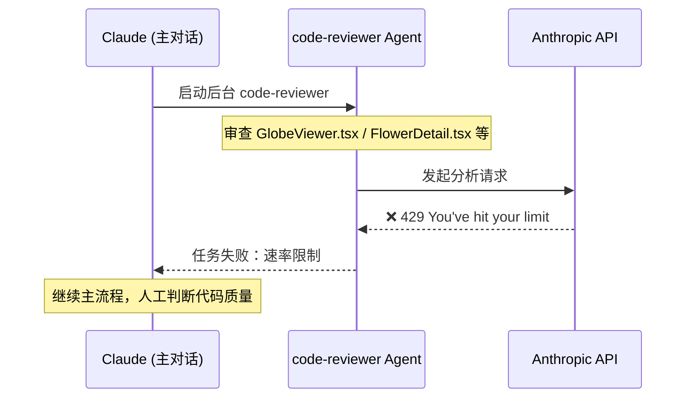
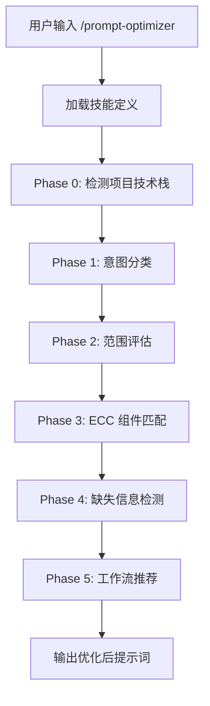
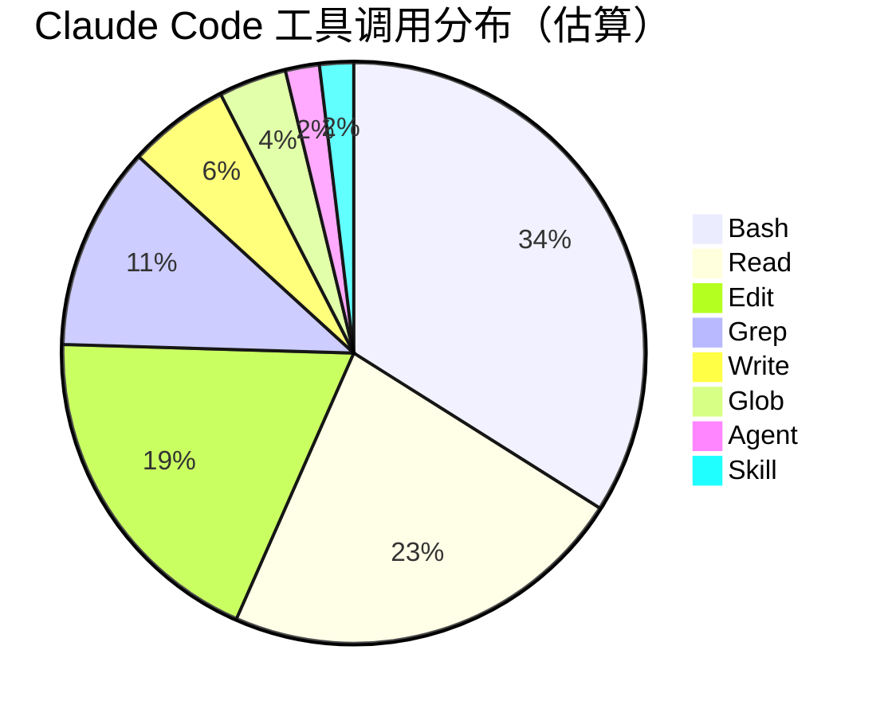
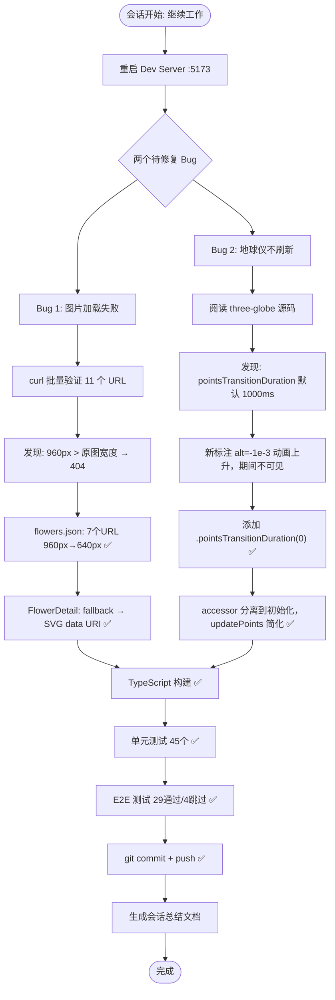
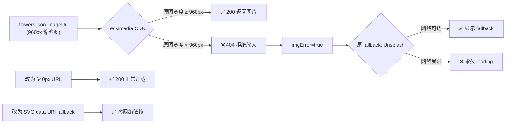
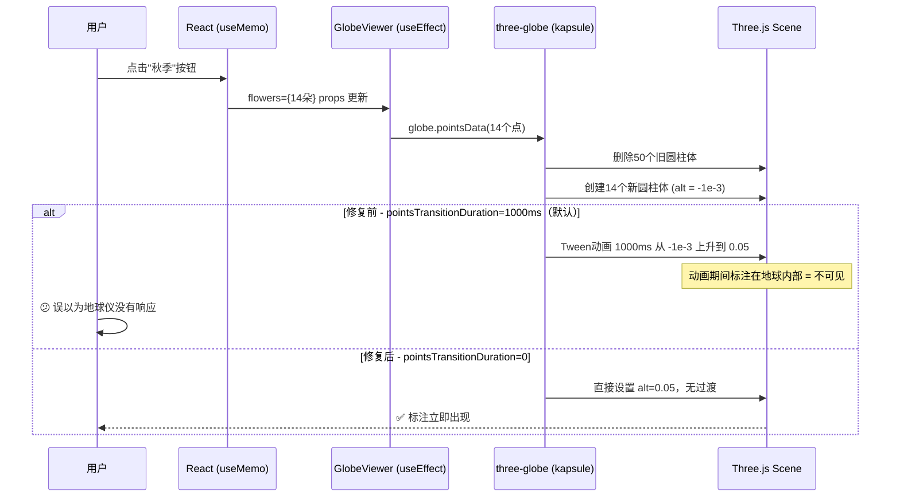
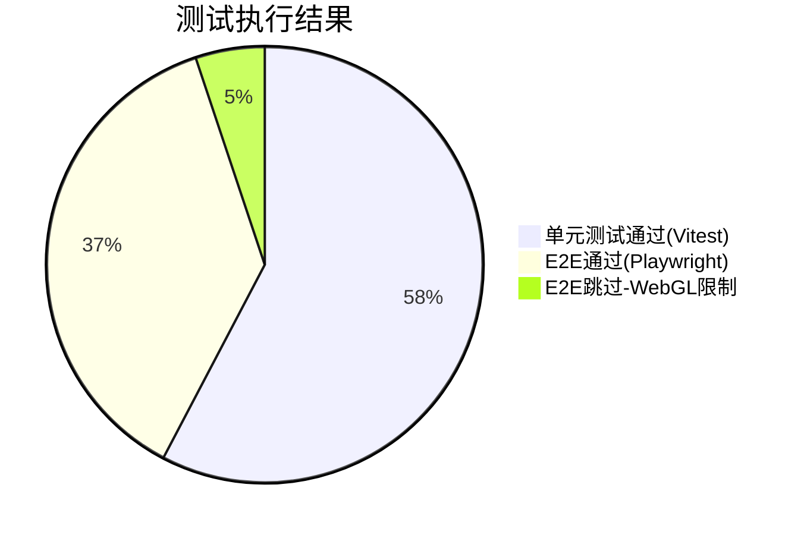
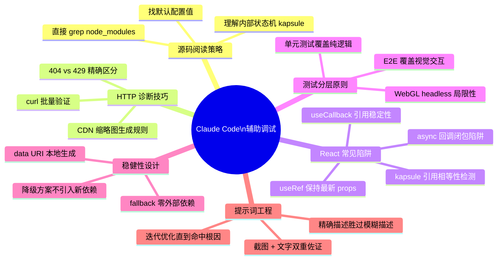

# 中国花卉地图应用 Bug 修复实践探索之旅

> **主题：** AI 辅助复杂前端 Bug 根因分析与修复
> **日期：** 2026-04-09
> **受众：** AI 学习者 / Claude Code 使用者
> **会话 ID：** `4eea8bb4-cec3-491c-80f3-e42145be7d55`
> **项目路径：** `/data/ai/claudecode/openspec/open-spec-first/china-flowers-app`
> **GitHub 地址：** [https://github.com/chujun/open-spec-first](https://github.com/chujun/open-spec-first)

---

## 一、主要用户价值

| 价值维度 | 描述 |
|---------|------|
| **精准根因定位** | 两个视觉 Bug 表面现象相似，根因完全不同，AI 通过逐层追踪数据流准确找到症结 |
| **三方库源码调试** | 直接读 `node_modules` 源码，发现 `pointsTransitionDuration` 隐藏默认值 1000ms |
| **HTTP 诊断方法论** | 用 `curl` 批量检验 CDN 图片 URL，精确区分 404（文件不存在）vs 429（限速存在） |
| **零依赖 fallback 设计** | 用 SVG data URI 替代外链 fallback，任意网络环境下稳健运行 |
| **测试分层实践** | 明确哪些逻辑必须单元测试、哪些场景必须 E2E，不相互替代 |
| **提示词迭代价值** | 用户经历 3 轮提示词优化才准确描述出 Bug 2 现象，体现精确描述的重要性 |

---

## 二、开发环境

| 项目 | 详情 |
|------|------|
| **操作系统** | Linux 6.8.0-107-generic |
| **Shell** | bash |
| **包管理器** | npm |
| **代码交互工具** | Claude Code CLI（终端交互式） |
| **版本控制** | Git，分支 `main` |
| **Dev Server** | Vite 8，端口 5173（被占用时自动递增至 5175） |
| **测试运行环境** | Vitest（单元）/ Playwright headless chromium（E2E） |
| **浏览器** | Chrome（含 Immersive Translate 插件） |

---

## 三、技术栈

```mermaid
graph TD
    subgraph 前端框架层
        A[React 19] --> B[TypeScript]
        B --> C[Vite 8]
    end

    subgraph 3D渲染层
        D[Three.js] --> E[three-globe v2.45.1]
        E --> F[kapsule 响应式状态管理]
        F --> G[data-bind-mapper]
        G --> H[DataBindMapper / ThreeDigest]
    end

    subgraph UI层
        I[framer-motion] --> J[动画面板]
        K[lucide-react] --> L[图标系统]
    end

    subgraph 测试层
        M[Vitest] --> N[单元测试]
        M --> O[@vitest/coverage-v8 覆盖率]
        P[Playwright] --> Q[E2E 测试]
    end

    subgraph 数据层
        R[flowers.json 50条] --> S[loader.ts]
        S --> T[filterBySeason]
        T --> U[visibleFlowers]
    end
```

| 层级 | 技术 | 版本 | 说明 |
|------|------|------|------|
| 框架 | React | 19 | Hooks 架构 |
| 语言 | TypeScript | — | 严格模式 |
| 构建 | Vite | 8 | HMR + Rolldown |
| 3D 地球 | three-globe | v2.45.1 | 本次 Bug 根因所在库 |
| 3D 引擎 | Three.js | — | WebGL 渲染 |
| 响应式状态 | kapsule | — | three-globe 内部状态管理 |
| 动画 | framer-motion | — | 面板滑入动效 |
| 单元测试 | Vitest | — | 45 个测试 |
| E2E | Playwright | — | 33 个测试场景 |
| 覆盖率 | @vitest/coverage-v8 | — | 100%（loader.ts） |

---

## 四、AI 模型 / 插件 / Agent / 技能 / MCP 使用统计

### 4.1 AI 大模型

| 模型 ID | 名称 | 用途 | 调用次数 |
|---------|------|------|---------|
| `claude-sonnet-4-6` | Claude Sonnet 4.6 | 本次会话全程：代码分析、源码阅读、修复实现、文档生成 | 主对话全程 |

### 4.2 插件（Plugin）

| 插件包 | 来源 | 说明 |
|--------|------|------|
| `everything-claude-code` | Claude Code 插件市场 | 提供技能、Agent 等扩展能力的插件集合 |

### 4.3 Agent（智能代理）

> Agent 是 Claude Code 启动的专用子进程，拥有独立上下文和工具权限。

| Agent | 类型 | 触发方式 | 执行结果 | 说明 |
|-------|------|---------|---------|------|
| `code-reviewer` | 内置 Agent | Claude 主动调用（后台运行） | ❌ 触发速率限制（API limit） | 对 4 个修改文件进行代码审查，因 token 配额耗尽未完成 |



### 4.4 技能（Skill）

> Skill 是预定义的提示词模板，通过 `/skill-name` 命令触发，扩展 Claude Code 能力。

| 技能 | 触发命令 | 触发方 | 调用次数 | 执行结果 |
|------|---------|-------|---------|---------|
| `prompt-optimizer` | `/everything-claude-code:prompt-optimizer` | 用户 | 3 次 | 第 1 次：无参数，被用户中断；第 2 次：带参数，输出优化后提示词；第 3 次：当前请求 |

**技能执行流程：**


### 4.5 MCP 服务（Model Context Protocol）

| MCP 服务 | 工具前缀 | 是否调用 | 调用次数 | 说明 |
|---------|---------|---------|---------|------|
| **Playwright MCP** | `mcp__playwright__` | ⬜ 未直接调用 | 0 | E2E 测试通过 CLI `npx playwright test` 运行，未使用 MCP 工具 |
| **Context7 MCP** | `mcp__context7__` | ⬜ 未调用 | 0 | 文档检索服务，本次未使用 |

> 💡 **学习提示：** MCP 工具（如 `mcp__playwright__browser_navigate`）适合需要精细控制浏览器步骤的场景；批量跑测试用 CLI 命令更高效。

### 4.6 Claude Code 内置工具调用统计

| 工具 | 用途 | 估计调用次数 |
|------|------|------------|
| `Bash` | curl 验证 URL / npm 命令 / git 操作 / sed 替换 | ~18 次 |
| `Read` | 读取源码文件 / 图片截图分析 | ~12 次 |
| `Edit` | 修改 tsx / ts / json / md 文件 | ~10 次 |
| `Write` | 创建文档文件 | 3 次 |
| `Grep` | 搜索源码关键词 | ~6 次 |
| `Glob` | 查找文件列表 | 2 次 |
| `Agent` | 启动 code-reviewer 子代理 | 1 次 |
| `Skill` | 执行 prompt-optimizer 技能 | 1 次（Claude 侧） |



### 4.7 浏览器插件（用户环境）

| 插件 | 影响 | 说明 |
|------|------|------|
| **Immersive Translate**（沉浸式翻译） | 控制台输出干扰日志 | 报错 `content_script.js ERROR: [render-paragraph] skipped insert due to same text` 与应用无关，可忽略 |

---

## 五、会话主要内容

### 5.1 任务全景



### 5.2 Bug 1 — Wikimedia 图片 404 根因



### 5.3 Bug 2 — three-globe 动画陷阱根因



---

## 六、测试结果



| 类型 | 框架 | 数量 | 覆盖率 | 跳过原因 |
|------|------|------|-------|---------|
| 单元测试 | Vitest | **45 ✅** | 100%（loader.ts） | — |
| E2E 测试 | Playwright | **29 ✅ / 4 ⏭** | — | WebGL canvas hit-test 在 headless 模式下不可靠 |

---

## 七、用户提示词清单（原文，一字未改）

### 【上一会话（已压缩到摘要）】

**提示词 1：**
```
重启服务
```

**提示词 2：**
```
china-flowers-app
```

**提示词 3：**
```
修复两个问题 1.补充花朵url,部分花朵没有图片url 2.季节筛选功能没有完全生效，筛选后3D地球仪上没有过滤 每个任务按照后面的需求开发流程推进: /everything-claude-code:build-fix, /code-review, /test-coverage, /e2e-testing, 最后更新文档材料，再按照标准规范提交代码
```

**提示词 4：**
```
2.测试
```

**提示词 5：**
```
两个问题还是没有修复，可能是我问题描述的不准确 1.点击花朵详情后,图片url无法加载成功，判断加载失败原因并修复 2.@/tmp/eaf08e3dbfe2dd111df0912bea157995.png，查看截图红框信息，下方选择秋季后，显示14中花卉，但是3D地球仪中的花卉标签还是最终的50个，并没有重新渲染刷新 3.测试场景可以使用单元自测覆盖的，评估优先使用单元自测覆盖,因为e2e端到端测试执行效率比较慢，不过需要注意不能使用单元自测覆盖e2e端到端覆盖 每个任务按照后面的需求开发流程推进: /everything-claude-code:build-fix, /code-review, /test-coverage, /e2e-testing, 最后更新文档材料，再按照标准规范提交代码
```

---

### 【当前会话】

**提示词 6：**
```
继续工作
```

**提示词 7：**
```
原有花卉服务关闭，然后重启服务
```

**提示词 8：**
```
content_script.js:4871 Immersive Translate ERROR: [render-paragraph] skipped insert due to same text {sentenceId: 2, paragraphId: '2', translationMode: 'dual'}，控制台报错了，@/tmp/eaf08e3dbfe2dd111df0912bea157995.png ，查看截图红框信息，下方选择秋季后，显示14中花卉，但是3D地球仪中的花卉标签还是最终的50个，并没有重新渲染刷新
```

**提示词 9：**
```
根据本次会话聊天内容，整理出markdown文档，要求包含图表，图表使用Mermaid格式
```

**提示词 10：**
```
根据本次会话聊天内容，整理出markdown文档，输出到 @doc/ai-explore/日期-主题.md, 文档以XX应用实践探索之旅为主题，总结本次主要会话主要内容,  ，主要受众是AI学习者，要求包含图表，图表使用Mermaid格式
```

**提示词 11：**
```
根据本次会话聊天内容，整理出markdown文档，输出到 @doc/ai-explore/日期-主题.md, 文档以XX应用XXX实践探索之旅为主题，总结本次主要会话主要内容
，另外同时还需要包括主要用户价值、开发环境、开发工具、AI大模型、插件、MCP等使用情况统计、技术栈、用户输入的提示词清单(原样输出，一个字不要改)，项目github地址(没有就暂无)，项目路径，会话ID ，主要受众是AI学习者，要求包含图表，图表使用Mermaid格式
```

**提示词 12：**
```
根据本次会话聊天内容，整理出markdown文档，输出到 @doc/ai-explore/日期-主题.md, 文档以XX应用XXX实践探索之旅为主题，总结本次主要会话主要内容
，另外同时还需要包括主要用户价值、开发环境、开发工具、AI大模型、插件/AGENG/技能/MCP等使用情况统计、技术栈、用户输入的提示词清单(原样输出，一个字不要改)，项目github地址(没有就暂无)，项目路径，会话ID ，主要受众是AI学习者，要求包含图表，图表使用Mermaid格式。   注意:新的提示与前面一个差异点在于插件/AGENG/技能/MCP等使用情况统计
```

---

## 八、AI 辅助调试经验（面向 AI 学习者）



| 经验 | 核心教训 |
|------|---------|
| 读三方库源码 | 很多"玄学 Bug"根因就在 `node_modules` 的默认配置值 |
| HTTP 状态码精确含义 | 404 ≠ 429；混淆会导致错误结论和无效修复 |
| fallback 不依赖外网 | fallback 引入新外部依赖反而更脆，data URI 才是真正的保底 |
| Agent 也有速率限制 | 后台 Agent 可能因 token 配额失败，核心工作不依赖 Agent 结果 |
| 提示词需要迭代 | 用户用 3 条提示词才准确描述出 Bug 2，精确描述是高效协作的基础 |

---

*文档生成时间：2026-04-09 | 由 Claude Sonnet 4.6 (`claude-sonnet-4-6`) 辅助生成*
