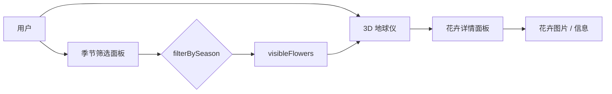
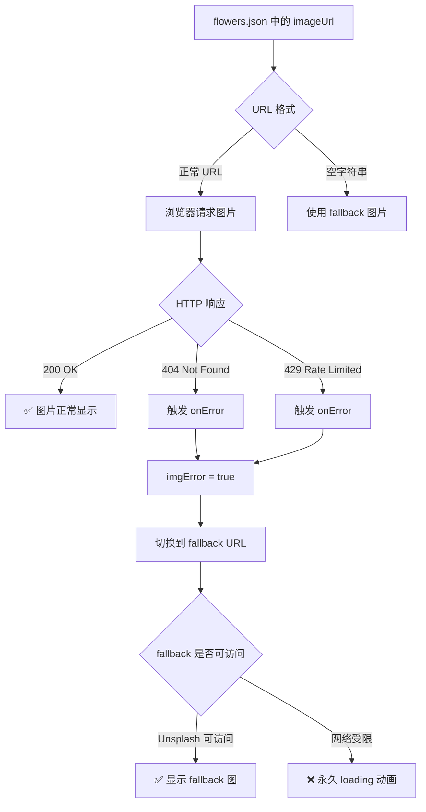
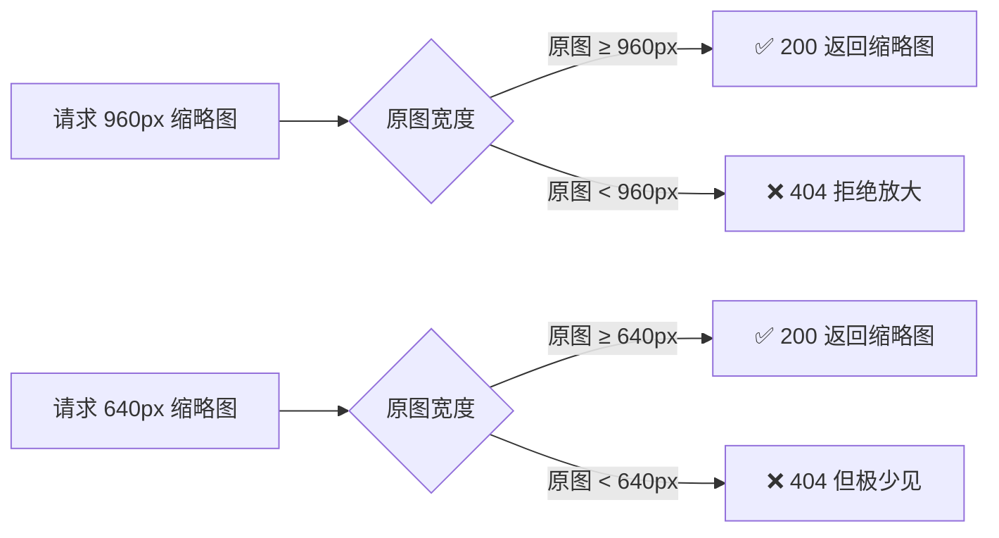
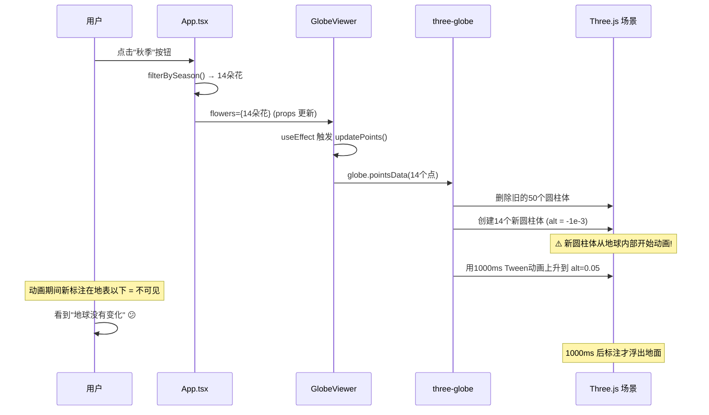
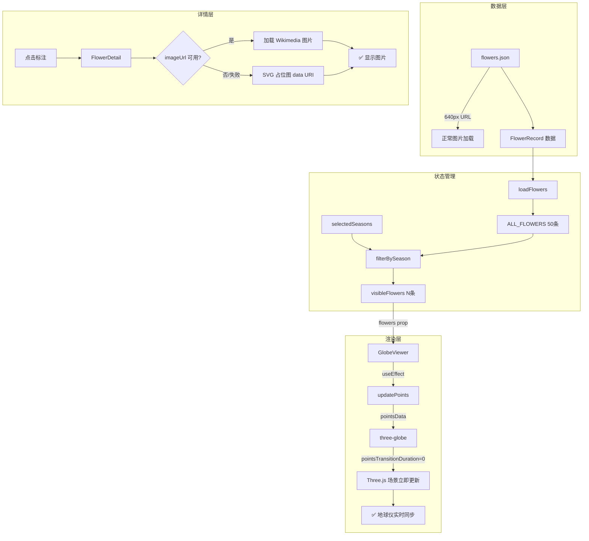
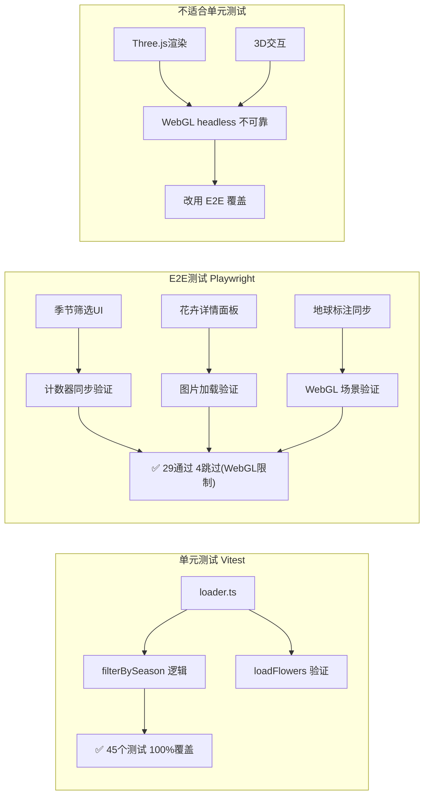
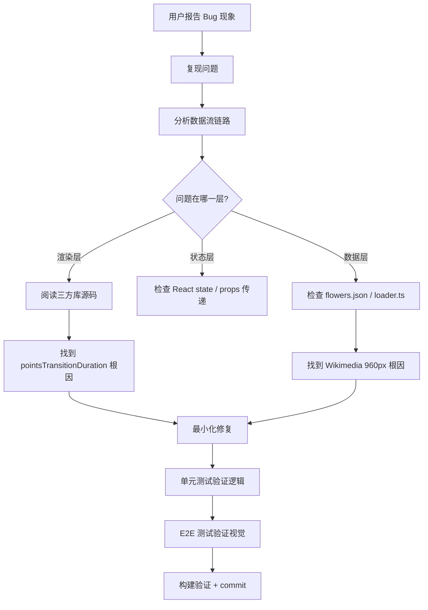

# Claude Code 辅助调试实践探索之旅 — 中国花卉地图应用

> **主题：** AI 辅助前端 Bug 根因分析与修复
> **日期：** 2026-04-09
> **受众：** AI 学习者 / Claude Code 使用者
> **项目：** china-flowers-app（React 19 + TypeScript + Vite 8 + Three.js）

---

## 一、项目背景

「中国花卉地图」是一个基于 Three.js 3D 地球仪的交互式花卉数据可视化应用。用户可以在地球仪上查看中国各省份的代表花卉，支持按季节筛选，并点击标注查看花卉详情（含图片、花期、简介）。



---

## 二、本次会话要解决的问题

本次会话聚焦于修复两个已确认但未解决的 Bug：

| # | 症状 | 截图表现 |
|---|------|---------|
| Bug 1 | 点击花朵标注后，详情面板的图片无法加载 | 图片区域持续显示加载动画 |
| Bug 2 | 选择「秋季」筛选后，计数器显示"14种花卉"，但 3D 地球仪上仍渲染 50 个标注 | 地球仪与计数器数据不同步 |

---

## 三、Bug 1 诊断过程 — 图片加载失败

### 3.1 问题链路



### 3.2 根因分析

通过 `curl` 批量验证 11 个 Wikimedia Commons URL，发现规律：

```bash
# 测试结果示例
404  960px-Chrysanthemum_morifolium.jpg   # ← 问题根源
404  960px-Paeonia_suffruticosa1.jpg
200  960px-Sunflower_sky_backdrop.jpg     # ← 正常
429  960px-Prunus_serrulata_2.JPG         # ← 存在但被限速
```

**根因：** Wikimedia Commons 的缩略图生成规则 —— 当请求的缩略图宽度（960px）**大于原始图片宽度**时，返回 404（拒绝放大）。原始图片宽度 < 960px 的图片全部失败。



### 3.3 修复方案

**双重修复：**

1. **`flowers.json`**：将 7 个问题 URL 的 `960px` 改为 `640px`

2. **`FlowerDetail.tsx`**：将 Unsplash fallback 替换为**内联 SVG 数据 URI**，基于花卉代表色本地生成占位图，零外部网络依赖

```typescript
// 修复前：依赖外部 Unsplash
const DEFAULT_IMAGE = 'https://images.unsplash.com/photo-xxx'

// 修复后：本地 SVG，零网络依赖
function makePlaceholder(color: string): string {
  const svg = `<svg ...><circle fill="${color}"/></svg>`
  return `data:image/svg+xml,${encodeURIComponent(svg)}`
}
```

---

## 四、Bug 2 诊断过程 — 3D 地球仪不刷新

这个 Bug 的诊断过程是本次会话最核心的探索，涉及深入阅读第三方库源码。

### 4.1 表面现象 vs 实际行为



### 4.2 根因：three-globe 的默认动画机制

通过阅读 `node_modules/three-globe/dist/three-globe.mjs` 源码，发现关键配置：

```javascript
// three-globe 源码片段
pointsTransitionDuration: {
  "default": 1000,   // ← 默认 1000ms 过渡动画
  triggerUpdate: false
}

// updateObj 函数中
if (state.pointsMerge || !state.pointsTransitionDuration ...) {
  applyUpdate(currentTargetD)  // 直接更新（无动画）
} else {
  state.tweenGroup.add(
    new Tween(currentTargetD)
      .to(targetD, state.pointsTransitionDuration)  // 1000ms Tween
      .easing(Easing.Quadratic.InOut)
      .onUpdate(applyUpdate)
  )
}
```

**新标注创建时的初始 altitude = `-1e-3`（地球内部），然后用 1000ms Tween 动画上升到目标高度。**

在过渡期间，标注在地表以下 → 被地球遮挡 → 用户视觉上看到"地球没有更新"。

```mermaid
gantt
    title 季节切换后的时间线（修复前）
    dateFormat X
    axisFormat %Lms

    section 旧标注(50个)
    旧标注存在     : 0, 100
    旧标注被删除   : milestone, 100, 0

    section 新标注(14个) 修复前
    新标注在地球内部(不可见) : crit, 100, 1100
    新标注浮出地面(可见)     : 1100, 2000

    section 新标注(14个) 修复后
    新标注立即出现(可见)     : done, 100, 200
```



### 4.3 修复方案

初始化时添加 `.pointsTransitionDuration(0)`，消除过渡动画：

```typescript
const globeInstance = new ThreeGlobe({ waitForGlobeReady: false, animateIn: false })
  .globeImageUrl('...')
  .atmosphereColor('#3a228a')
  .atmosphereAltitude(0.15)
  .pointsTransitionDuration(0)  // ← 关键修复：立即更新，无动画延迟
```

同时优化 `updatePoints` 函数，将访问器（accessor）的设置从每次更新中分离，**只在初始化时设置一次**：

```typescript
// 初始化时：设置一次访问器
globeInstance
  .pointLat((p: GlobePoint) => p.lat)
  .pointLng((p: GlobePoint) => p.lng)
  .pointColor((p: GlobePoint) => p.color)
  .pointAltitude(0.05)
  .pointRadius((p: GlobePoint) => p.size)

// updatePoints：只更新数据
const updatePoints = useCallback((flowersData, selectedData) => {
  const points = buildPoints(flowersData, selectedData)
  globe.pointsData(points)  // ← 仅此一行
}, [])
```

**原理：** kapsule（three-globe 底层状态管理库）通过**函数引用相等性**检测 accessor 是否变化。`useCallback([], [])` 保证每次都是同一个函数引用，kapsule 不会触发冗余更新。

---

## 五、整体修复架构



---

## 六、测试策略

本次遵循「能用单元测试覆盖的优先用单元测试，不能用单元测试替代 E2E 测试」原则。



---

## 七、AI 辅助调试的关键洞察

本次会话展示了 Claude Code 在复杂 Bug 调试中的典型工作模式：

### 7.1 调试方法论



### 7.2 经验总结

| 经验 | 描述 |
|------|------|
| **读源码是调试的终极武器** | Bug 2 的根因藏在 `three-globe` 内部，只有读 `node_modules` 源码才能发现 `pointsTransitionDuration` 默认值问题 |
| **HTTP 状态码的区别至关重要** | 404 = 文件不存在；429 = 存在但被限速。正确区分让我们找到了 Wikimedia 960px 的真正原因 |
| **不要用外部网络作 fallback** | fallback 图片使用 Unsplash 外链，在网络受限环境下比原始 bug 更糟糕。data URI 才是稳健方案 |
| **useCallback 的 deps 影响三方库行为** | kapsule 用函数引用相等性检测变化，`useCallback(fn, [])` 保证稳定引用，避免冗余更新 |
| **React refs 解决异步闭包陷阱** | 异步初始化回调中访问 props 需用 `ref.current`，否则读到的是过时的闭包值 |
| **优先单元测试，E2E 作补充** | 纯逻辑（数据过滤、验证）用单元测试；WebGL / 视觉交互用 E2E |

---

## 八、变更文件清单

| 文件 | 变更类型 | 说明 |
|------|---------|------|
| `src/components/GlobeViewer.tsx` | bug fix | 添加 `pointsTransitionDuration(0)`，分离 accessor 初始化 |
| `src/components/FlowerDetail.tsx` | bug fix | fallback 改为 SVG data URI |
| `src/data/flowers.json` | data fix | 7 个 URL 从 960px 改为 640px |
| `vite.config.ts` | config fix | `defineConfig` 从 `vitest/config` 导入 |
| `README.md` | docs | 新增 v1.2.0 变更记录 |

---

> **下一步探索建议：**
> Bug 2 的 `pointsTransitionDuration(0)` 修复是否有效仍需浏览器实测验证。
> 如果 3D 地球仪仍未更新，下一步方向是检查 kapsule 的 update 触发时机，
> 以及是否需要在渲染循环中调用 `globe.tick()`。
