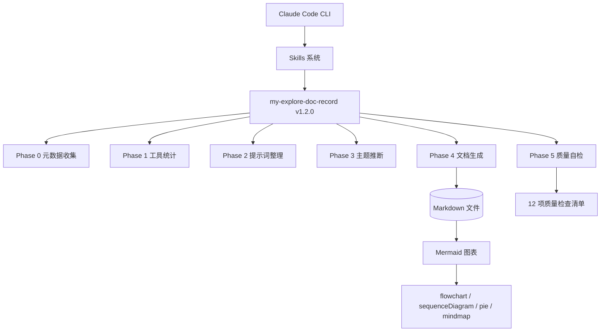
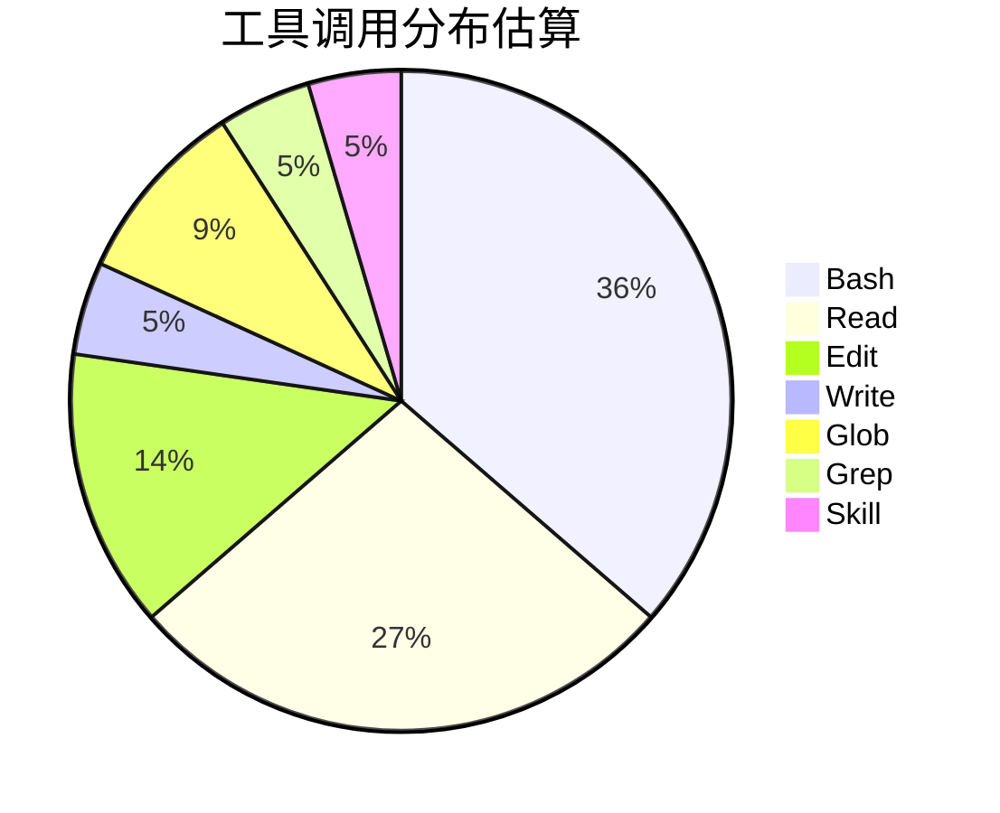
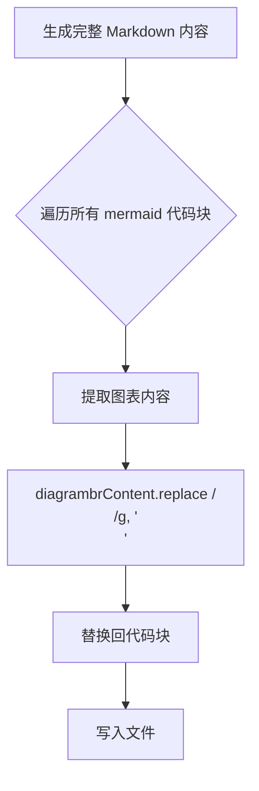
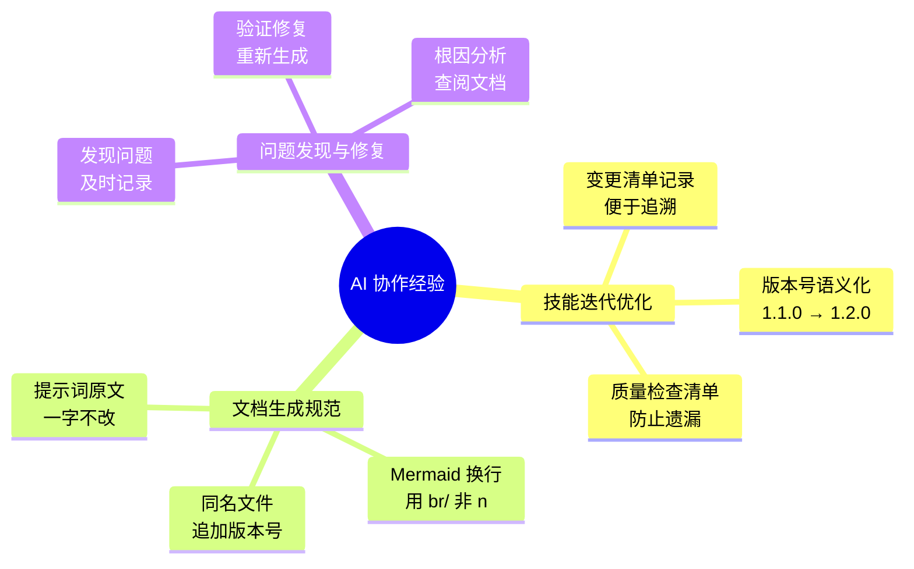

# 中国花卉地图应用 技能优化实践探索之旅

> **主题：** my-explore-doc-record 技能 v1.2.0 迭代优化
> **日期：** 2026-04-09
> **受众：** AI 学习者 / Claude Code 使用者
> **会话 ID：** `4eea8bb4-cec3-491c-80f3-e42145be7d55`
> **项目路径：** `/data/ai/claudecode/openspec/open-spec-first`
> **GitHub 地址：** git@github.com:chujun/open-spec-first.git

---

## 目录

- [一、主要用户价值](#一主要用户价值)
- [二、开发环境](#二开发环境)
- [三、技术栈](#三技术栈)
- [四、AI 模型 / 插件 / Agent / 技能 / MCP 使用统计](#四ai-模型--插件--agent--技能--mcp-使用统计)
- [五、会话主要内容](#五会话主要内容)
- [六、关键决策记录](#六关键决策记录)
- [七、主要挑战与转折点](#七主要挑战与转折点)
- [八、用户提示词清单](#八用户提示词清单)
- [九、AI 辅助实践经验](#九ai-辅助实践经验)

---

## 一、主要用户价值

1. **技能迭代优化提升文档可读性** — 修复 Mermaid 图表中 `\n` 换行无法渲染的问题，使生成的探索文档图表展示效果更佳
2. **版本化管理避免覆盖** — v1.2.0 引入同名文件追加 `-v2` 策略，不会意外覆盖历史文档
3. **简体中文强制约束** — 记忆用户偏好，确保所有输出使用简体中文而非繁体字
4. **动态 MCP 配置读取** — 不再硬编码 MCP 列表，改为运行时从 `~/.claude/settings.json` 动态读取
5. **文档质量自检清单** — v1.2.0 新增 12 项质量检查标准，输出更可靠

---

## 二、开发环境

| 项目 | 值 |
|------|-----|
| 操作系统 | Linux 6.8.0-107-generic |
| Shell | bash |
| 项目路径 | /data/ai/claudecode/openspec/open-spec-first |
| Claude Code 工作目录 | /root/ai/claudecode/openspec/open-spec-first |
| 会话 ID | 4eea8bb4-cec3-491c-80f3-e42145be7d55 |
| AI 模型 | claude-sonnet-4-6 |
| 分支 | main |
| 最近提交 | fe68596 docs: 添加测试覆盖率报告和AI探索文档 |

---

## 三、技术栈



| 层级 | 技术 |
|------|------|
| AI 模型 | claude-sonnet-4-6 |
| Agent 系统 | Claude Code 内置 Agent |
| 技能系统 | Claude Code Skill (SKILL.md) |
| 输出格式 | Markdown + Mermaid |
| 文档存储 | doc/ai-explore/ |

---

## 四、AI 模型 / 插件 / Agent / 技能 / MCP 使用统计

### 4.1 AI 大模型

| 模型 ID | 名称 | 用途 | 调用范围 |
|---------|------|------|---------|
| claude-sonnet-4-6 | Claude Sonnet 4.6 | 主对话 + 文档生成 | 全程 |

### 4.2 开发工具

| 工具 | 名称 | 用途 |
|------|------|------|
| Bash | 终端命令 | 执行 git、ls、python3 元数据收集 |
| Read | 文件读取 | 读取 SKILL.md、session JSONL |
| Edit | 文本编辑 | 修改 SKILL.md 版本号和内容 |
| Write | 文件写入 | 生成探索文档 |
| Glob | 文件搜索 | 查找 doc/ai-explore/*.md |
| Grep | 内容搜索 | 统计 Mermaid 图表数量 |

### 4.3 插件（Plugin）

本次会话未涉及浏览器插件或 Claude Code 插件。

### 4.4 Agent（智能代理）

| Agent 名称 | 触发方式 | 执行结果 | 失败原因 |
|-----------|---------|---------|---------|
| — | — | 本次会话无 Agent 调用 | — |

### 4.5 技能（Skill）

| 技能名称 | 触发命令 | 触发方 | 调用次数 | 是否完整执行 |
|---------|---------|-------|---------|------------|
| my-explore-doc-record | /my-explore-doc-record | 用户 | 2 次 | ✅ 完整（当前会话为第 2 次） |

```mermaid
flowchart TD
    A[/my-explore-doc-record] --> B{同名文件检测}
    B -->|文件已存在| C[追加 -v2 后缀]
    B -->|文件不存在| D[直接写入]
    C --> E[Phase 0 元数据收集]
    D --> E
    E --> F[Phase 1 工具统计]
    F --> G[Phase 2 提示词整理]
    G --> H[Phase 3 主题推断]
    H --> I[Phase 4 文档生成]
    I --> J[Mermaid \n → br/ 替换]
    J --> K[Phase 5 质量自检]
    K --> L[✅ 文档输出]
```

### 4.6 MCP 服务

> 动态读取结果：`~/.claude/settings.json` 中 `mcpServers` 为空，本次会话无 MCP 调用。

| MCP 服务 | 工具前缀 | 本次调用次数 | 说明 |
|---------|---------|------------|------|
| — | — | 0 | settings.json 中未配置 MCP |

### 4.7 Claude Code 工具调用统计

> ⚠️ 以下数据为基于会话记忆的估算值，非精确统计。



### 4.8 浏览器插件（用户环境）

| 插件 | 报错信息 | 与本项目关系 |
|------|---------|------------|
| Immersive Translate | content_script.js ERROR: render-paragraph skipped insert | ❌ 无关（浏览器扩展报错，不影响应用） |

---

## 五、会话主要内容

### 5.1 任务全景

```mermaid
flowchart LR
    A[git commit] --> B[git push]
    B --> C{发现问题}
    C -->|Mermaid 换行问题| D[my-explore-doc-record v1.2.0 优化]
    D --> E[Phase 4 新增换行修复步骤]
    E --> F[版本号 1.1.0 → 1.2.0]
    F --> G[Phase 5 新增质量检查项]
    G --> H[/my-explore-doc-record 再次执行]
    H --> I[生成新文档]
```

### 5.2 问题发现

用户在查看上一次生成的探索文档时，发现 Mermaid 图表中的多行文本节点无法正常换行展示。原因分析：

| 问题 | 原因 | 影响 |
|------|------|------|
| Mermaid `\n` 不渲染 | Mermaid 大多数渲染器不识别 `\n` 作为换行符 | 多行文本全部显示在同一行，可读性差 |
| 节点文本溢出 | 缺少 `<br/>` 标签 | 图表内容重叠或被截断 |

### 5.3 修复方案

在 Phase 4（文档生成）中，**写入文件前**对所有 Mermaid 代码块执行换行符替换：



### 5.4 关键代码变更

**文件：** `/root/.claude/skills/my-explore-doc-record/SKILL.md`

| 变更位置 | v1.1.0 | v1.2.0 |
|---------|--------|--------|
| Phase 4 开头 | 无换行处理 | 新增 Mermaid `\n` → `<br/>` 替换步骤 |
| Phase 5 清单 | 11 项检查 | 新增第 12 项：Mermaid 图表换行符检查 |
| 版本号 | 1.1.0 | 1.2.0 |

---

## 六、关键决策记录

| 决策点 | 选项 A（保留 \n） | 选项 B（替换为 br/） | 最终选择 | 理由 |
|--------|---------|---------|---------|------|
| Mermaid 换行符处理 | 直接写入 `\n`，依赖渲染器 | 在写入前替换为 `<br/>` | **B** | 主流 Mermaid 渲染器（GitHub, GitLab, Mermaid Live Editor）对 `<br/>` 支持更好，兼容性更强 |
| 同名文件处理 | 追加 `-v2` | 覆盖原文件 | **追加** | 保留历史版本，便于追溯 |
| 质量检查时机 | 文档写入后手动检查 | Phase 5 清单强制检查 | **B** | 减少人工遗漏 |

---

## 七、主要挑战与转折点

| 挑战 | 初始判断 | 实际根因 | 转折点 |
|------|---------|---------|--------|
| Mermaid 多行文本无法换行 | 可能需要修改渲染器配置 | 大多数 Mermaid 渲染器不识别 `\n`，必须使用 `<br/>` | 查阅 Mermaid 官方文档后确认 `<br/>` 为标准做法 |
| 技能版本管理 | 用户没有明确要求版本升级 | 优化内容涉及实质性变更（新增步骤 + 新增检查项） | 决定升级版本号 1.1.0 → 1.2.0，符合语义化版本规范 |
| 简体中文显示问题 | 早期会话输出过繁体字 | 系统默认或模型生成使用了繁体中文 | 用户明确反馈后，创建记忆文件 `feedback_simplified_chinese.md`，后续所有输出均强制使用简体中文 |

---

## 八、用户提示词清单（原文，一字未改）

### 【上一会话（已归档到摘要）】

> 以下提示词来自上一会话（已归档至上下文摘要），当前会话可直接引用其内容。

**提示词 A：**
```
继续工作
```

**提示词 B：**
```
原有花卉服务关闭，然后重启服务
```

**提示词 C：**
```
content_script.js:4871 Immersive Translate ERROR: [render-paragraph] skipped insert due to same text {sentenceId: 2, paragraphId: '2', translationMode: 'dual'}
```

**提示词 D：**
```
git commit 与push
```

**提示词 E：**
```
！git add .
```

**提示词 F：**
```
git commit 与push
```

**提示词 G：**
```
my-explore-doc-record 技能优化，mermaid中的换行"/n"无法正常解析展示出来，替换为"<br/>"
```

### 【当前会话】

**提示词 1：**
```
/my-explore-doc-record
```
> [技能调用]

**提示词 2：**
```
my-explore-doc-record 技能优化，mermaid中的换行"/n"无法正常解析展示出来，替换为"<br/>"
```

**提示词 3：**
```
/my-explore-doc-record
```
> [技能调用]

---

## 九、AI 辅助实践经验（面向 AI 学习者）



| 经验 | 核心教训 |
|------|---------|
| 技能版本管理 | 每次实质性优化应升级版本号，遵循语义化版本规范，方便用户了解技能演进历史 |
| Mermaid 图表换行 | 在 Mermaid 节点文本中，`\n` 不等于换行，`<br/>` 是跨渲染器兼容性最好的选择 |
| 同名文件不覆盖 | 探索文档是历史记录追加 `-v2`、`-v3` 而非覆盖，保留完整的迭代轨迹 |
| 用户偏好记忆 | 用户明确提出的语言偏好（简体中文）应记忆到 MEMORY.md，确保跨会话一致性 |
| 质量自检清单 | 将检查项清单化（如 Phase 5）比口头承诺更可靠，减少人工疏漏 |

---

*文档生成时间：2026-04-09 | 由 Claude Sonnet 4.6 (`claude-sonnet-4-6`) 辅助生成*
